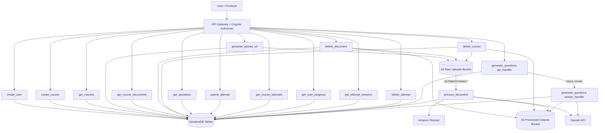

# Lambda Functions Flow

This document maps all Lambda functions in `backend/template.yaml` and how each one is triggered.

## Trigger Summary

- **User-triggered via API Gateway:** all functions except `process_document` and `generate_questions worker_handler`.
- **Event-triggered:** `process_document` is triggered by S3 object creation in the raw uploads bucket.
- **Lambda-to-Lambda async trigger:** `generate_questions api_handler` invokes `generate_questions worker_handler` asynchronously.
